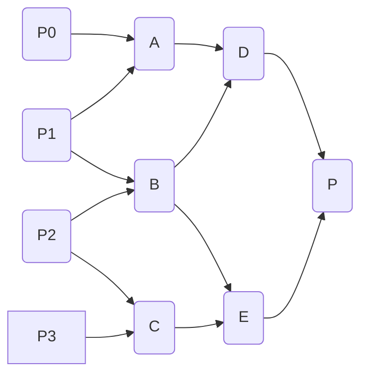

# Affine Transformation

Extend linear transformation with translation part
$$
(TL)p=\begin{bmatrix} 1&0&0&t_x \\ 0&1&0&t_y \\ 0&0&1&t_z \\ 0&0&0&1 \end{bmatrix}\begin{bmatrix} a&b&c&0 \\ d&e&f&0 \\ g&h&i&0 \\ 0&0&0&1 \end{bmatrix}\begin{bmatrix} x\\y\\z\\1 \end{bmatrix}
$$
where the matrix $T$ is translation, $L$ is linear transformation (rotation, scaling, etc.), and point $p$ is a given example. Point needs to be extended with $1$ in the 4th dimension to make the math works. 

This can also be shortened to:
$$
TL=\begin{bmatrix} l&t\\0&1 \end{bmatrix}=\begin{bmatrix} i&t\\0&1 \end{bmatrix}\begin{bmatrix} l&0\\0&1 \end{bmatrix}
$$
To invert, $(TL)^{-1}=L^{-1}T^{-1}$

## Normal

A normal at point $p_0$ is $n$ satisfies
$$
n\cdot(p_0-p)=0
$$
where $p$ is other *very* nearby points.

A transformation has the following effect on normal:
$$
\begin{bmatrix}nx'\\ny'\\nz'\end{bmatrix}=(L^{-1})^T\begin{bmatrix}nx\\ny\\nz\end{bmatrix}
$$
Note that the translation part has no effect, just the linear transformation part. 
If $L$ is rotation, then $(L^{-1})^T=L$ (property of orthonormal linear transformation).

## Frame

Frame is the basis vector which finalize the coordinates.
$$
\vec{f}^Tc
$$
is coordinate $c$ in frame $\vec{f}^T$.

A frame may be transformed:
$$
\vec{f}^Tc\Rightarrow(\vec{f}^TA)(A^{-1}c)
$$
Then, the new frame is $\vec{f}^TA$ and the same point in the new frame is $A^{-1}c$.

Now, do a transformation under this new frame:
$$
(\vec{f}^TA)TR(A^{-1}c)
$$
We say that $TR$ is applied under the frame (with respect to the frame) $\vec{f}^TA$.

In graphics, this gets used as:
$$
p=\vec{o}^Tc=\vec{w}^TOc=\vec{e}^TE^{-1}Oc
$$
where $\vec{o}^T$, $\vec{w}^T$, and $\vec{e}^T$ is the object, world, and eye frame. 
The $E^{-1}O$ is called the model view matrix.

To apply some transformation $TR$ to object under frame $A$, do:
$$
\vec{w}^TA(TR)A^{-1}O
$$
For most objects, it is a good idea to do transformation under the object's translation but with eye's rotation, that is $A=O_TE_R$

## Look At

For an eye at $e$ looking at $p$, the transformation can be constructed as:
$$
\begin{aligned}
z&=\operatorname{normalize}(e-p) \\
x&=\operatorname{normalize}(u\times z) \\
y&=z\times x
\end{aligned}
$$
where $u$ is the "up" direction. Then put them into a matrix:
$$
E=\begin{bmatrix} x_1&y_1&z_1&e_1 \\ x_2&y_2&z_2&e_2 \\ x_3&y_3&z_3&e_3 \\ 0&0&0&1 \end{bmatrix}
$$
This is using OpenGL direction standard (-z is the viewing direction, x and y follow right hand rule).

# Quaternion

$$
q=a+b\hat i+c\hat j+d\hat k
$$
where $\hat i$, $\hat j$, and $\hat k$ are related by $\hat i^2=\hat j^2=\hat k^2=\hat i \hat j \hat k =-1$ and are also perpendicular to each other by right hand rule.

A quaternion representing rotation can be constructed as:
$$
q=\cos(\theta/2)+\sin(\theta/2)(x\hat i+y\hat j+z\hat k)
$$
where $x$, $y$, and $z$ are the normalized rotation axis. Note that for all rotation related stuff, the assumption is that everything is normalized.

For each rotation, there are 2 corresponding quaternions: $q$ and $-q$. This is because for every rotation, you can either rotate around an axis $r$ by $\theta$ or rotate around $-r$ by $-\theta$.

Applying the rotation on a point $p=x\hat i+y\hat j+z\hat k$ (real part is 0), the output $p'$ is
$$
p'=q\cdot p\cdot q^{-1}
$$
where $q^{-1}=\cos(\theta/2)-\sin(\theta/2)(q_x\hat i+q_y\hat j+q_z\hat k)$ for unit quaternion.

For inverse of general quaternion, 
$$
q^{-1}=\frac{\bar{q}}{|q|^2}=\frac{a-b\hat i-c\hat j-d\hat k}{a^2+b^2+c^2+d^2}
$$

Quaternion multiplication (aka, Hamilton product), is
$$
q_1\cdot q_2=\begin{alignedat}{4}&a_{1}a_{2}&&-b_{1}b_{2}&&-c_{1}c_{2}&&-d_{1}d_{2}\\{}+{}(&a_{1}b_{2}&&+b_{1}a_{2}&&+c_{1}d_{2}&&-d_{1}c_{2})\hat {i} \\{}+{}(&a_{1}c_{2}&&-b_{1}d_{2}&&+c_{1}a_{2}&&+d_{1}b_{2})\hat {j} \\{}+{}(&a_{1}d_{2}&&+b_{1}c_{2}&&-c_{1}b_{2}&&+d_{1}a_{2})\hat {k} \end{alignedat}
$$

Quaternion can be converted to an equivalent rotation matrix using
$$
\begin{bmatrix}
1 - 2(c^2 + d^2) & 2(b c - d a) & 2(b d + c a) \\
2(b c + d a) & 1 - 2(b^2 + d^2) & 2(c d - b a) \\
2(b d - c a) & 2(c d + b a) & 1 - 2(b^2 + c^2)
\end{bmatrix}
$$

## Interpolating rotation

It is based on the idea that
$$
R_t=(R_1R_0^{-1})^tR_0
$$
The power on quaternion is defined as
$$
q^t=\cos(t\theta/2)+\sin(t\theta/2)(x\hat i+y\hat j+z\hat k)
$$

Sphere-based SLERP:
$$
\frac{\sin((1-t)\Omega)}{\sin(\Omega)}v_0+\frac{\sin(t\Omega)}{\sin(\Omega)}v_1
$$
where $\Omega$ is the angle between $v_0$ and $v_1$, that is $\Omega=\arccos(v_0\cdot v_1)$.

# Bezier Curve and Spline

## Quadratic Bezier Curve

De Casteljau's algorithm generates a path from some control points by using lerp. For the quadratic curve, 3 points are used.
```
A=lerp(P0, P1, t)
B=lerp(P1, P2, t)
P=lerp(A, B, t)
```
Expressed in math:
$$\begin{aligned}
A&=(1-t)P_0+(t)P_1 \\
B&=(1-t)P_1+(t)P_2 \\
P&=(1-t)A+(t)B
\end{aligned}$$
Solve for $P$ by recursive substitution:
$$\begin{aligned}
P&=(1-t)((1-t)P_0+(t)P_1)+(t)((1-t)P_1+(t)P_2) \\
&=(1-t)^2P_0+2t(1-t)P_1+t^2P_2 \\
&= \begin{bmatrix}t^0&t^1&t^2\end{bmatrix} \begin{bmatrix} 1&0&0 \\ -2&2&0 \\ 1&-2&1 \end{bmatrix} \begin{bmatrix}P_0\\P_1\\P_2\end{bmatrix}
\end{aligned}$$

## Cubic Bezier Curve

For the cubic curve, 4 points are used:
```
A=lerp(P0, P1, t)
B=lerp(P1, P2, t)
C=lerp(P2, P3, t)
D=lerp(A, B, t)
E=lerp(B, C, t)
P=lerp(D, E, t)
```
Expressed in math:
$$\begin{aligned}
P&=(1-t)^3P_0+3(1-t)^2tP_1+3(1-t)t^2P_2+t^3P_3 \\
&=\begin{bmatrix}t^0&t^1&t^2&t^3\end{bmatrix} \begin{bmatrix} 1&0&0&0 \\ -3&3&0&0 \\ 3&-6&3&0 \\ -1&3&-3&1 \end{bmatrix} \begin{bmatrix}P_0\\P_1\\P_2\\P_3\end{bmatrix}
\end{aligned}$$

## General Bezier Curve

The term of the Bezier Curve, also known as the Bernstein basis polynomial, is:
$$
B_{i,n}(t)={n\choose i}(1-t)^{n-i}t^i
$$
Properties:
- Curve is contained by the convex hull of control points
- Variation Diminishing: number of intersections of a straight line with a Bezier curve is at most the number of intersections of the same line with the convex hull
- Affine Invariance: applying affine transform to control points applies it to whole curve

## Polar Form

The dependency of lerp of a cubic Bezier curve can be visualized as:



If the lerp progress for each layer is $t_1$, $t_2$, $t_3$, the output point of the polar form is $f(t_1,t_2,t_3)$. 
If  $t_1$, $t_2$, $t_3$ are different, the point would lie outside the Bezier curve.

![[bezier-polar-form.png|550]]
https://graphics.stanford.edu/courses/cs348a-21-winter/ReaderNotes/handout21.pdf

To obtain the polar form, fully expand the Bezier curve in polynomial form and replace each $t^k$ with arithmetic average of $k$ product of $t_i$:

| Degree | $t^k$ | Replacement                |
| ------ | ----- | -------------------------- |
| 2      | $t^1$ | $(t_1+t_2)/2$              |
| 2      | $t^2$ | $t_1t_2$                   |
| 3      | $t^1$ | $(t_1+t_2+t_3)/3$          | 
| 3      | $t^2$ | $(t_1t_2+t_1t_3+t_2t_3)/3$ |
| 3      | $t^3$ | $t_1t_2t_3$                |

Properties:
- n-affine: $af(u_0,t_1,t_2)+bf(u_1,t_1,t_2)=f(au_0+bu_1,t_1,t_2)$ for constants $a,b,t_1,t_2$ and $a+b=1$.
- Parameter order independent (symmetric). That is $f(t_1,t_2,t_3)=f(t_1,t_3,t_2)=f(t_2,t_1,t_3)=f(t_2,t_3,t_1)=f(t_3,t_1,t_2)=f(t_3,t_2,t_1)$.
- The relation $F(t)=f(t_1,t_2,\ldots)$ is unique under two above properties

## Catmull-Rom Spline

Using a given control point $C_0$ and $C_1$, set the in between point of the cubic Bezier curve as 
$$\begin{aligned}
P_1&=C_0+\frac{1}{6}(C_1-C_{-1})\\
P_2&=C_1-\frac{1}{6}(C_2-C_0)\\
\end{aligned}$$
![[An-example-of-a-Catmull-Rom-spline.png|500]]
https://www.researchgate.net/figure/An-example-of-a-Catmull-Rom-spline_fig1_50838845

Catmull-Rom is a type of Cardinal spline, and Cardinal spline is a type of Hermite spline.
- A Hermite spline is a spline where points and velocity are supplied. Hermite splines with only outgoing velocity are $C^1$ continuity
- A Cardinal spline is a Hermite spline where the velocity at $P_i$ is set by $\tau(P_{i+1}-P_{i-1})$
- Catmull-Rom spline is a Cardinal spline with $\tau=0.5$
For general Hermite spline, divide the velocity by 3 and mirror(copy) that around the control point to get the cubic Bezier point.

## Continuity

### Parametric Continuity
$$
C^k:\ \frac{d^i}{dt^i}(F(t))=\frac{d^i}{dt^i}(G(t)) ,\ \forall i\le k
$$
Check the derivatives. 
- $C^0$ means connected (spline is connected without breaks)
- $C^1$ adds velocity is constant
- $C^2$ adds acceleration is constant

For Cubic Bezier spline:
- $C^0$: make sure the control point is connected properly
- $C^1$: set the handle to have equal length (i.e., equal velocity at anchor point)
- $C^2$: the only control possible is the anchor point itself

### Geometric Continuity
$$
G^k:\ \frac{d^i}{dt^i}(F(t))=\frac{d^i}{dt^i}(G(a(t))) ,\ \forall i\le k
$$
Only check the shape. The $a(t)$ part re-parameterize so that the continuity doesn’t depend on parameterization.
- $G^0$ means connected
- $G^1$ means there's no sharp corner. Tangent continuity (the tangent unit vector is continuous)
- $G^2$ means curvature is continuous
- $C^k$ continuity implies $G^k$ continuity as long as the curve doesn't stop (have velocity of 0)

# Geometry of Rasterization

## Homogeneous Coordinates

A system where $(x,y,w)=(kx,ky,kw)$ for $k\neq 0$. To convert to regular coordinates, divides all components by $w$: $(x,y,z)=(x/w,y/w,1)$.
The point $(0,0,0)$ is invalid point. 
Points with $w=0$ are considered to be at infinity. There is only one infinity point for each direction: $(x,y,0)=(kx,ky,0)$.

Line is $ax+by+cw=0$. The line $0x+0y+cw=0$ hits all infinity points, and this is the only line that does so.

Every 2 distinct lines intersect at unique point (maybe infinity)

## Rendering Pipeline

Object → Eye → Clip → NDC (Normalized device coordinates) → Window

Object → Eye: Use camera position/rotation and apply the inverse the the whole world. The camera is now at the origin and the coordinates of other objects move accordingly.

Eye → Clip: Projection matrix. Vertex that falls outside a certain range is clipped off. The clip coordinates is homogeneous coordinates that is the return result of vertex shaders.

Clip → NDC: Divides by $w$ according to homogeneous coordinates.

NDC → Window: Project the NDC by x,y coordinates and scales it to fit window.

## Shadow Mapping

Shadow mapping can be done by rendering the depth buffer from the light source's perspective. For the final pass, check the pixel's distance to light and the depth buffer. If they are equal, they are in light, otherwise they are in shadow.

## Discrete Sampling

Anti-aliasing:
$$
I[i][j]=\iint I(x,y)F_{i,j}(x,y)dxdy
$$
where $F$ is called a filter.

Super sampling: many points are sampled
Multi sampling: internally renders at higher resolution and downscale for final image

Nyquist theorem: if a function $f$ has no frequency higher than $B$ Hz, the sampling rate $2B$ Hz is sufficient.

# Color and Light

Let $(k_s(\lambda),k_m(\lambda),k_l(\lambda))$ be the coordinate representing short/medium/long eye cone cell's sensitivity to wavelength $\lambda$. For a mixed wavelength light $l(\lambda)$, it is:
$$
(\int l(\lambda)k_s(\lambda)d\lambda,\int l(\lambda)k_m(\lambda)d\lambda,\int l(\lambda)k_l(\lambda)d\lambda)
$$
## Color Matching

Given a light of wavelength $\lambda$, find the values of $k_{435}(\lambda),k_{545}(\lambda),k_{645}(\lambda)$ such that the mixed light created by these primary colors matched the original light. 
$$
c(l)=\begin{bmatrix}c(435)&c(545)&c(645)\end{bmatrix}\begin{bmatrix}\int l(\lambda)k_{435}(\lambda)d\lambda \\ \int l(\lambda)k_{545}(\lambda)d\lambda \\ \int l(\lambda)k_{645}(\lambda)d\lambda\end{bmatrix}
$$
This is a linear color space. Alternate color space is also possible, including non-linear color space.
