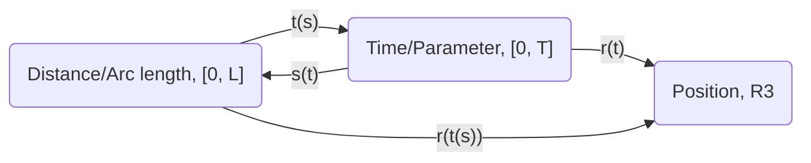

## Arc Length

Let function $r(t: \R): \R^3$ be a path (arc) in 3D space.

The arc length is found by integrating the speed over time:

$$
\int_{t_{start}}^{t_{end}}|r'(t)|dt
$$

Define the function of distance so far as:

$$
s(t)=\int_0^t|r'(\tau)|d\tau
$$

The corresponding inverse function, of elapsed time at distance, can be found since the function $s(t)$ is an increasing function (except at $t=0$):

$$
t(s)
$$

Thus, we can have a function that takes in arc length and returns position in 3D space:

$$
\~{r}(s)=r(t(s))
$$

Unit tangent vector is defined as:

$$
T(t)=\frac{r'(t)}{|r'(t)|}
$$

$$
\~{T}(s)=\frac{d}{ds}\~{r}(s)=\~{T}(s(t))
$$

Then, we get curvature as:

$$
\~{\Kappa}(s)=|\frac{d}{ds}\~{T}(s)|=|\frac{d}{dt}T(t)|\frac{1}{|r'(t)|}
$$

> Note: For a circle of radius $R$, the curvature is $1/R$.

### Dependency on Parameterization

Consider arcs that are defined differently (using different parameterization), but have the exact same shape. Some properties are only dependent on the shape and are independent on parameterization, such as tangent vector $T(t)$. Some properties are also dependent on parameterization, such as velocity $r'(t)$.

## TNB Frame and Coordinate System

Coordinate system consisting T(s), N(s), B(s); which are unit tangent vector, principal unit normal vector, and binormal unit vector.

$$
T(s)=r'(s)\quad N(s)=\frac{T'(s)}{|T'(s)|}\quad B(s)=T(s)\times N(s)
$$

> Note: $K(s)=T'(s)=r''(s)$ indicates the "force" if the particle is pulled some kind of gravitational field from a mass. This is related to curvature, a scalar value, by $\Kappa(s)=|K(s)|$.

This system is defined on arc length $s$, so this system will fail if:

1. the particle stops moving at some point: $|r'(t)|\neq0$
2. the particle must always be curving: $\Kappa(s)\neq0$

### Binormal

$$
B'(s)=-\tau(s)N(s)
$$

where $\tau(s)$ is a scalar real value called "torsion", which describes how the plane formed by $T$ and $N$ is twisting.

> Note: The minus sign in this equation is by convention.

### Defined on parameter $t$

For property $F$, we can:

$$
F_s'(s)=F_t'(t(s))=F_t'(t)\frac{dt}{ds}=F_t'(t)\frac{1}{|r'(t)|}
$$

The TNB frame on parameter $t$:

$$
T(t)=\frac{r'(t)}{|r'(t)|}\quad N(t)=\frac{T'(t)}{|T'(t)|}\quad B(s)=T(s)\times N(s)
$$

$$
K(t)=\frac{T'(t)}{|r'(t)|}\quad \tau(t)=-\frac{1}{|r'(t)|}B'(t)\cdot N(t)
$$
