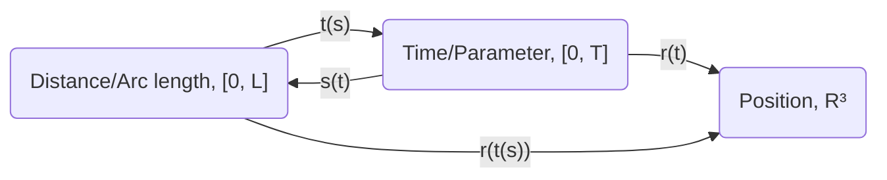

## Arc Length

Let function $r(t: \R): \R^3$ be a path (arc) in 3D space.

The arc length is found by integrating the speed over time:

$$
\int_{t_{start}}^{t_{end}}|r'(t)|dt
$$

Define the function of distance so far as:

$$
s(t)=\int_0^t|r'(\tau)|d\tau
$$

The corresponding inverse function, of elapsed time at distance, can be found since the function $s(t)$ is an increasing function (except at $t=0$):

$$
t(s)
$$

Thus, we can have a function that takes in arc length and returns position in 3D space:

$$
\~{r}(s)=r(t(s))
$$

Unit tangent vector is defined as:

$$
T(t)=\frac{r'(t)}{|r'(t)|}
$$

$$
\~{T}(s)=\frac{d}{ds}\~{r}(s)=\~{T}(s(t))
$$

Then, we get curvature as:

$$
\~{\Kappa}(s)=|\frac{d}{ds}\~{T}(s)|=|\frac{d}{dt}T(t)|\frac{1}{|r'(t)|}
$$

> Note: For a circle of radius $R$, the curvature is $1/R$.

### Dependency on Parameterization

Consider arcs that are defined differently (using different parameterization), but have the exact same shape. Some properties are only dependent on the shape and are independent on parameterization, such as tangent vector $T(t)$. Some properties are also dependent on parameterization, such as velocity $r'(t)$.

## TNB Frame and Coordinate System

Coordinate system consisting T(s), N(s), B(s); which are unit tangent vector, principal unit normal vector, and binormal unit vector.

$$
T(s)=r'(s)\quad N(s)=\frac{T'(s)}{|T'(s)|}\quad B(s)=T(s)\times N(s)
$$

> Note: $K(s)=T'(s)=r''(s)$ indicates the "force" if the particle is pulled some kind of gravitational field from a mass. This is related to curvature, a scalar value, by $\Kappa(s)=|K(s)|$.

This system is defined on arc length $s$, so this system will fail if:

1. the particle stops moving at some point: $|r'(t)|\neq0$
2. the particle must always be curving: $\Kappa(s)\neq0$

### Binormal

$$
B'(s)=-\tau(s)N(s)
$$

where $\tau(s)$ is a scalar real value called "torsion", which describes how the plane formed by $T$ and $N$ is twisting.

> Note: The minus sign in this equation is by convention.

### Defined on parameter $t$

For property $F$, we can:

$$
F_s'(s)=F_t'(t(s))=F_t'(t)\frac{dt}{ds}=F_t'(t)\frac{1}{|r'(t)|}
$$

The TNB frame on parameter $t$:

$$
T(t)=\frac{r'(t)}{|r'(t)|}\quad N(t)=\frac{T'(t)}{|T'(t)|}\quad B(s)=T(s)\times N(s)
$$

$$
K(t)=\frac{T'(t)}{|r'(t)|}\quad \tau(t)=-\frac{1}{|r'(t)|}B'(t)\cdot N(t)
$$

### Summary

$$
T=\frac{v}{|v|}\quad N=\frac{T'}{|T'|}\quad B=T\times N
$$

$$
\tau=-\frac{dB}{ds}N
$$

$$
K=\frac{dT}{ds}=\frac{T'}{|v|}\quad \kappa=|K|=\frac{1}{\text{R}}
$$

$$
a_T=\frac{d|v|}{dt}\quad a_N=\frac{|v|^2}{R}=\kappa |v|^2
$$

## Polar Coordinates

Define the basis vectors as:

$$
\hat r=\cos(\theta)\hat i+\sin(\theta)\hat j\qquad \hat \theta=-\sin(\theta)\hat i+\cos(\theta)\hat j
$$

Using this system, any position $x$ can be denoted as $x=r\hat r$ for any radius $r$ from origin. Since $\hat r$ rotates to follow $\theta$, there is no need to encode $\theta$ separately.

Velocity and acceleration can be obtained directly using derivatives:

$$
v=\frac{dx}{dt}=\frac{dr}{dt}\hat r+\frac{d\hat r}{dt}r=\frac{dr}{d\theta}\frac{d\theta}{dt}\hat r+\frac{d\hat r}{d\theta}\frac{d\theta}{dt}r=\frac{dr}{d\theta}\dot\theta\hat r+\hat\theta\dot\theta r
$$

$$
a=\dot v=\dots
$$

## Matrix Multiplication

> Note: The notation $(x_1;\,x_2;\,x_3;\,\ldots;\,x_n)$ indicates column vectors. This is the default shape for vectors.

Define $T:\R^n\rarr\R^m$ is linear function if $T(ax+by)=aT(x)+bT(y)$.

Then: $T(\bm{0})=\bm{0}$.

If linear function is given, there always exists an equivalent matrix: $Ax=T(x)$.

The transformation defined using matrix, such as $T(x)=Ax$, is always linear.

### Products

Inner product (or Dot product) for $x,\,y\in\R^n$:

$$
x\cdot y=(x^T)(y)=\sum_{i=1}^nx_iy_i
$$

Outer product (or Tensor product) for $x\in\R^n,\,y\in\R^m$:

$$
x\otimes y=(x)(y^T)
$$

By putting $x$ as the leftmost column and $y$ as the topmost row and each cell is the multiplication of the leftmost column and topmost row, the tensor product is obtained from the resulting table.

### Matrix Multiplication by Component

$A\times B=C$, where $C_{i,k}=A_{i,*}\cdot B_{*,k}$

### Matrix Multiplication by Column Vector

Given a matrix $A$ and a vector $x$:

$$
Ax=x_1A_{*,1}+x_2A_{*,2}+\ldots+x_nA_{*,n}
$$

So, now consider $A\in\R^{m\times n},\,B\in\R^{n\times l}$:

$$
AB=A(B_{*,1},B_{*,2},\ldots,B_{*,l})=(AB_{*,1},AB_{*,2},\ldots,AB_{*,l})=(C_{*,1},C_{*,2},\ldots,C_{*,3})
$$

Matrix multiplication can be seen as many multiplication of column vectors by breaking down $B$ into individual column vectors.

### Matrix Multiplication by Row Vector

$$
AB=\begin{pmatrix} A_{1,*} \\ A_{2,*} \\ \vdots \\ A_{m,*} \end{pmatrix}B=\begin{pmatrix} A_{1,*}B \\ A_{2,*}B \\ \vdots \\ A_{m,*}B \end{pmatrix}=\begin{pmatrix} C_{1,*} \\ C_{2,*} \\ \vdots \\ C_{m,*} \end{pmatrix}
$$

Matrix multiplication can be seen as many multiplication of row vectors by breaking down $B$ into individual row vectors.

### Matrix Multiplication by Tensor Product

[[Usual matrix multiplication|MAS102.Basics#matrix-multiplication-by-component]] is done row-by-col. But what if we take the tensor product by doing col-by-row:

$$
AB=(A_{*,1},A_{*,2},\ldots,A_{*,n})\begin{pmatrix} B_{1,*} \\ B_{2,*} \\ \vdots \\ B_{m,*} \end{pmatrix}=\sum_{j=1}^nA_{*,j}\otimes B_{j,*}
$$

## Multi-variable Vector-valued Function

### Shape

Defined an open ball as:

$$
B(c,r)=\{x\in\R^n;|x-c|<r\}
$$

Given a body $D$ and a point $c$, there are three cases:

- Interior point when there exists $r>0$ and $B(c,r)\subset D$
- Exterior point when there exists $r>0$ and $|B(c,r)\cap D|=0$
- Boundary point otherwise

$D$ is an open set if there is no boundary point. The opposite is called closed set.

$B(c,r)$ is an open set because the condition is $|x-c|<r$, thus it doesn't have a boundary.

### Graph, Image, Level Set, and Contour

Graph of $f: \R^n\rarr \R^m$ is an object in $\R^{n+m}$ space.

Level set of $f:\R^n\rarr\R$ where $f(x)$ equals to some constant, usually $\R^{n-1}$ object. Example: ${x\in\R^n;f(x)=0}$ is a zero level set.

Contour is a collection of level set. Example: contour lines.

### Limit and Continuity

$L\in\R^m$ is the limit of $f(x\to c):\R^n\rarr\R^m$ exactly when $\forall(\epsilon>0)\exist(\delta>0)(|f(x)-L|<\epsilon\land|x-c|<\delta)$.

$f$ is continuous at $c$ if $f(c)=lim_{x\to c}(f(x))$

### Differentials

Directional Derivative: grab a line and apply derivative as if it is a scalar function.

> Note: Directional continuity in all direction doesn't imply function continuity.

Partial Derivation: the usual one using $\partial$. Specialization of Directional Derivative.

Gradient: for $f:\R^n\to\R^m$: $\nabla f(c)=(\frac{\partial f}{\partial x_1},\frac{\partial f}{\partial x_2},\ldots,\frac{\partial f}{\partial x_n}):\R^{m\times n}$

Full Derivation: Find linear $T:\R^n\to\R^m$ which approximates $f:\R^n\to\R^m$ at limit at some point $c$. If $T$ is found, it is called *differentiable*, and come with the properties:

- $f$ is directionally differentiable
- $T=\nabla f(c)$

The full detail is: $\forall(\epsilon>0)\exist(\delta>0)(|f(x)-(f(c)+T(x-c))|<\epsilon|x-c|\land|x-c|<\delta)$

If $f$ is directionally differentiable and $\nabla f(c)$ is continuous at $c$, then $f(c)$ is fully differentiable and $T=\nabla f(c)$

## Generalized Chain Rule

For differentiable $f$ and $g$ at $c$:

$$
\nabla(f(g(c)))=(\nabla f(g(c)))(\nabla g(c))
$$

So:

$$
\frac{df}{dt}=\frac{\partial f}{\partial x}\frac{dx}{dt}+\frac{\partial f}{\partial y}\frac{dy}{dt}+\frac{\partial f}{\partial z}\frac{dz}{dt}
$$

### Directional Derivative

Given $f:\R^n\to\R^m$ be differentiable at $c\in\R^n$, and $\hat{u}\in\R^n$:

$$
\text{D}_{\hat{u}}f(c)=\nabla f(c)\cdot\hat{u}
$$

Output is in $\R^m$.

## Extremum and Saddle Point

Local extremum is a point where there is not other point in open ball $B(c,r)$ greater/lesser than this one for any arbitrarily small radius.

Critical point is a point where $\nabla f(x)=0$ (or it doesn't exist).

Saddle point is a critical point but not extremum.

Hessian is the second order derivative. For $f:\R^2\to\R$:

$$
\text Hf=\begin{pmatrix} f_{xx} & f_{yx} \\ f_{xy} & f_{xx} \end{pmatrix}
$$

The determinant of Hessian matrix is $f_{xx}f_{yy}-f^2_{xy}$:

- If its value at critical point is negative, it is a saddle point.
- If its value at critical point is positive and $f_{xx}$ or $f_{yy}$ is positive, it is local minimum.
- If its value at critical point is positive and $f_{xx}$ or $f_{yy}$ is negative, it is local maximum.

### Lagrange Multiplier Method

When given a function $f$ to optimize, but restricted to only when $g$ equals a certain value, find the point where:

$$
\nabla f=\lambda\nabla g
$$

and also satisfies the constraint set by $g$. The $\lambda$ is a constant called *Lagrange Multiplier*.

The key insight is into how this works is that when the value of $f$ should be as big (or small) as possible, the contour surface of $f$ should barely graze the contour surface of $g$. Thus, the gradient of $f$ and $g$ should be in the same direction.

Extend for multiple constraints:

$$
\nabla f=\lambda_1\nabla g_1+\lambda_2\nabla g_2+\ldots
$$

## Regions and Fields

### Curl Operator

Curl is $\nabla\times F$ for a field $F$.

If $F$ is continuously differentiable (up to 2nd order), then $\nabla\times(\nabla F)=0$. (Curl of gradient is zero)

If $F$ is continuously differentiable (up to 2nd order), then $\nabla\cdot(\nabla\times F)=0$. (Divergence of curl is zero)

Note: $\nabla(\nabla\times F)$ (gradient of curl) is NOT zero.

### Simply Connected

This means that every path/loop can be nudged into any other path/loop. Alternatively: for every loop, the loop can be shrunk into a point.

Example of region that are not simply connected: 2D region with hole, 3D donut

Note: 3D region with a void is still simply connected.

### Conservative Field

A conservative field $F$ is a field where:

$$
\int_{c_1}F\cdot dr=\int_{c_2}F\cdot dr
$$

for paths $c_1$ and $c_2$ with the same origin and destination.

A potential vector field ($F=\nabla f$) is conservative.

For a conservative field $F$, the curl $\nabla\times F=0$. The reverse is true if the space is simply connected.

In simply connected $D\subset\R^3$ with $\nabla\times F=0$ in $D$, then for any curve $C$:

$$
\oint_C F\cdot dr=0
$$

## Multiple Integral

### Jacobian (Change of Variable)

The function $\psi$ converts the G space to D space:

$$
\begin{pmatrix} x \\ y \\ z \end{pmatrix}=\psi\begin{pmatrix} u \\ v \\ w \end{pmatrix}=\begin{pmatrix} \psi_1(u,v,w) \\ \psi_2(u,v,w) \\ \psi_3(u,v,w) \end{pmatrix}
$$

$$
\iiint_D f(x;y;z)\ dxdydz=\iiint_G f(\psi(u;v;w))|J(u,v,w)|\ dudvdw
$$

where $J(u,v,w)$ is the Jacobian, which corrects for the size differences in unit volume of the two space:

$$
J(u,v,w)=\frac{\partial(x,y,z)}{\partial(u,v,w)}=\begin{vmatrix} \frac{\partial x}{\partial u} & \frac{\partial y}{\partial u} & \frac{\partial z}{\partial u} \\ \frac{\partial x}{\partial v} & \frac{\partial y}{\partial v} & \frac{\partial z}{\partial v} \\ \frac{\partial x}{\partial w} & \frac{\partial y}{\partial w} & \frac{\partial z}{\partial w} \end{vmatrix}
$$

Note: Determinant can interchange rows and columns: i.e., x, y, z could be rows and u, v, w could be columns instead of what is shown.

### Unit Volumes

Polar (2D):

- $x=r\cos(\theta)$
- $y=r\sin(\theta)$
- $dx\ dy=r\ dr\ d\theta$

Cylindrical:

- $x=r\cos(\theta)$
- $y=r\sin(\theta)$
- $z=z$
- $dx\ dy\ dz=r\ dr\ d\theta\ dz$

Spherical:

$\rho$ is the distance, $\phi$ is the angle from z-axis (vertical line) which ranges from $0\degree$ to $180\degree$, and $\theta$ is the angle from x-axis in xy-plane which ranges from $0\degree$ to $360\degree$.

- $\rho=\sqrt{x^2+y^2+z^2}$
- $\phi=\arccos(\frac{z}{\sqrt{x^2+y^2+z^2}})$
- $\theta=\arctan(y/x)$

<!-- -->
- $x=\rho\sin(\phi)\cos(\theta)$
- $y=\rho\sin(\phi)\sin(\theta)$
- $z=\rho\cos(\phi)$
- $dx\ dy\ dz=\rho^2\sin(\phi)\ d\rho\ d\phi\ d\theta$

## Shape Integration

### Line Integrals

For curve $C=r(t)$ and scalar function $f$:

$$
\int_C f\ dr=\int f(r(t))|r'(t)|\ dt
$$

where $|r'(t)|$ is speed; $\sqrt{x'(t)^2+y'(t)^2+z'(t)^2}$ for coordinate cartesian system.

For vector function $F$, the speed cancels out:

$$
\int_C F\cdot dr=\int F(r(t))\cdot\frac{r'(t)}{|r'(t)|}|r'(t)|\ dt=\int F(r(t))\cdot r'(t)\ dt
$$

### Green's Theorem for Circulation

If we have $C$, a smooth connected closed loop. And $F=M\hat{i}+N\hat{j}$, a field that is continuously differentiable on the inside of the closed loop $C$. Then, the circulation is:

$$
\oint_C F\cdot dr=\iint_R \bigg(\frac{\partial N}{\partial x}-\frac{\partial M}{\partial y}\bigg)dxdy
$$

Intuition: The idea is that the region can be subdivided into really small cells. For each cell, we can find the circulation: "circulation density". Adding two adjacent cells give the circulation for the parameter of the two cells; the inner border cancels out. So, adding all of the cells gives the value of the closed loop.

The concept of circular density is related to curl: $\nabla\times F$. In this case, it is the $\hat{k}$ component of the curl.

Note: This is the [[Stoke's Theorem|MAS102.Notes#stokes-theorem]] applied in 2D.

### Green's Theorem for Flux

If we have $C$, a smooth connected closed loop. And $F=M\hat{i}+N\hat{j}$, a field that is continuously differentiable on the inside of the closed loop $C$. Then, the flux is:

$$
\oint_C F\cdot\hat{n}\ dr=\iint_R \bigg(\frac{\partial M}{\partial x}+\frac{\partial N}{\partial y}\bigg)dxdy
$$

Note: This is the [[Divergence Theorem|MAS102.Notes#divergence-theorem]] applied in 2D.

Note: for direct calculation of Flux in 2D for counter-clockwise direction:

$$
\oint_C F\cdot\hat{n}\ dr=\oint_C Mdy-Ndx
$$

### Surface Integral

$$
\int_S f\ ds=\int_D f(r(u,v))|r_u\times r_v|dudv
$$

where $r_u=\frac{\partial r}{\partial u}$ and $r_v=\frac{\partial r}{\partial v}$

For finding the surface area, uses $f=1$

### Surface Area

For continuously differentiable $F(x,y)$, and $|\nabla F\cdot k|\neq0$ ($k$ is the z-axis). The surface area of $F$ above the region $R$ (in xy-plane) is:

$$
\iint_R \frac{|\nabla F|}{|\nabla F\cdot k|}dxdy
$$

Note: Try rotating the axis to satisfy the condition

### Surface Flux

For field $F: \R^3\to\R^3$ and surface $S\subset \R^3$. The outward flux is:

$$
\iint_S F\cdot\vec{n}\ ds=\iint_D F(r(u,v))\cdot(r_u\times r_v)\ dudv
$$

where the region $D$ in uv-plane maps to the surface $S$.

### Stoke's Theorem

Let $S$ be piecewise smooth oriented bounded surface. The curve $C$ be the boundary of surface $S$. The function $F$ is continuously differentiable on open set including $S$

Then:

$$
\oint_C F\cdot dr=\iint_S (\nabla\times F)\cdot\hat{n}\ ds
$$

Note: direction follows right-hand convention. Only for 3D.

### Divergence Theorem

For continuously-differentiable field $F$, region $D$ bounded by a piecewise-smooth oriented surface $S$:

$$
\int_D \nabla\cdot F\ dv=\oint_S F\cdot\hat{n}\ ds
$$

Note: Works for any dimension.
