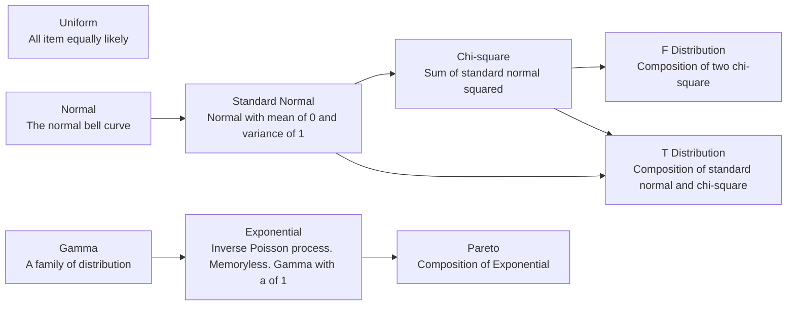

## Uniform Distribution

$$
U(a,b)\rArr f(x)=\begin{cases}
   \frac{1}{b-a} &\text{if } x\in[a,\,b]\\
   0 &\text{otherwise}
\end{cases}
$$
$$
E(X)=\frac{a+b}{2},\ Var(X)=\frac{(b-a)^2}{12}
$$

## Normal Distribution

$$
N(\mu,\sigma^2)=\frac{1}{\sqrt{2\pi}\sigma}\exp(-\frac{(x-\mu)^2}{2\sigma^2})
$$
$$
E(X)=\mu,\ Var(X)=\sigma^2
$$
$$
\phi(t)=\exp(\mu t+\frac{\sigma^2t^2}{2})
$$

Standard Normal Distribution:

$$
Z=N(0, 1)=\frac{X-\mu}{\sigma}
$$

Sum of Normal Distribution:

$$
\sum_{i=1}^nN(\mu_i,\sigma_i^2)=N\bigg(\sum_{i=1}^n\mu_i,\sum_{i=1}^n\sigma_i^2\bigg)
$$

### Chi-square Distribution

$$
\chi_n^2=\sum_{i=1}^nZ_i^2
$$
$$
\phi(t)=(1-2t)^-\frac{n}{2}
$$
$$
E(X)=n,\ Var(X)=2n
$$

For $a\in(0,1)$: $P(X>\chi_{a,n}^2)=a$.

$\chi_n^2=gamma(\frac{n}{2},\frac{1}{2})$. See: [[Gamma Distribution|MAS250.Special Continuous Random Variables#gamma-distribution]].

### T Distribution

$$
T_n=\frac{Z}{\sqrt{\chi_n^2/n}}
$$
$$
E(X)=0,\ Var(X)=\frac{n}{n-2}
$$

This distribution is symmetric.

For $a\in(0,1)$: $P(X>T_{a,n})=a$.

For large $n$: $T_n$ approximates $Z$.

### F Distribution

$$
F_{n,m}=\frac{\chi_n^2/n}{\chi_m^2/m}
$$

For $a\in(0,1)$: $P(X>F_{a,n,m})=1-P(X>\frac{1}{F_{a,n,m}})=a$.

### Exponential Distribution

The distribution of time between events in Poisson process. See: [[Poisson Distribution|MAS250.Special Discrete Random Variables#poisson-distribution]].

$$
Exp(\lambda)\rArr f(x)=\begin{cases}
   \lambda e^{-\lambda x} &\text{if } x\ge 0\\
   0 &\text{otherwise}
\end{cases}
$$
$$
E(X)=\frac{1}{\lambda},\ Var(X)=\frac{1}{\lambda^2}
$$
$$
F(x)=1-e^{-\lambda x}
$$
$$
\phi(t)=\frac{\lambda}{\lambda-t}\ \text{where}\ \lambda\gt t
$$

This distribution is equivalent to $gamma(1,\lambda)$. See: [[Gamma Distribution|MAS250.Special Continuous Random Variables#gamma-distribution]].

Memoryless property:

The random variable doesn't keep track of the time that passed, so it "resets" itself every time.

$$
P(X>s+t\,|\,X>t)=P(X>s)
$$

### Pareto Distribution

"80% of outcomes are due to 20% of causes".

Let $X=Exp(\lambda)$, the Pareto Distribution is $Y=a\,e^X$.

$E[Y]=a\frac{\lambda}{\lambda-1}$

## Gamma Distribution

$$
gamma(a,\lambda)\rArr f(x)=\begin{cases}
   \frac{\lambda\exp(-\lambda x)(\lambda x)^{a-1}}{\Gamma(a)} &\text{if } x\ge 0\\
   0 &\text{otherwise}
\end{cases}
$$
$$
E(X)=\frac{a}{\lambda},\ Var(X)=\frac{a}{\lambda^2}
$$
$$
\phi(t)=(\frac{\lambda}{\lambda-t})^a
$$

The Gamma function is:
$$
\Gamma(n)=(n-1)!=\int_0^\infty e^{-t}t^{n-1} dt
$$

For independent $X=gamma(a_x,\lambda)$ and $Y=gamma(a_y,\lambda)$:
$$
X+Y=gamma(a_x+a_y,\lambda)
$$
