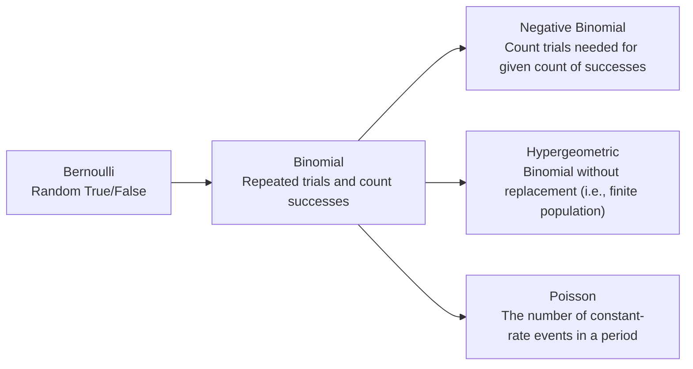

## Bernoulli Distribution

Random boolean: either False (0) or True (1).
$$
Ber(p)\rArr p(x)=p^x(1-p)^{1-x}
$$
$$
E(X)=p,\ Var(X)=p(1-p)
$$

## Binomial Distribution

Repeated $n$ trials, count $x$ as the number of successful trials.
$$
B(n,p)\rArr p(x)=\binom{n}{x}p^x(1-p)^{n-x}
$$
$$
E(X)=n\,p,\ Var(X)=n\,p(1-p)
$$

This distribution is equivalent to sum of independent Bernoulli trials:
$$
Ber(n,p)=\sum_{i=1}^{n}B(p)
$$

## Negative Binomial Distribution

A total of $r$ successful trials is needed, count $x$ as the number of all trials (successful and unsuccessful) performed.

$$
NB(r,p)\rArr p(x)=\binom{x-1}{r-1}p^r(1-p)^{x-r}
$$
$$
E(X)=\frac{r}{p},\ Var(X)=r\frac{1-p}{p^2}
$$

## Hypergeometric Distribution

Where as Binomial has infinite population (a trials doesn't affect the next trial's probability), hypergeometric distribution has finite population, thus a trial affect the next trial's probability.

Parameters are: $N$ is the number of "good" items, $M$ is the number of "bad" items, and $n$ is the number of picks.

$$
H(N,M,n)\rArr p(x)=\frac{\binom{N}{x}\binom{M}{n-x}}{\binom{N+M}{n}}
$$
$$
E(X)=\frac{nN}{N+M},\ Var(X)=\frac{nNM}{(N+M)^2}(1-\frac{n-1}{N+M-1})
$$

## Poisson Distribution

Given some events that is expected to occur $\lambda$ times in a given fixed period of time, count $x$ as the number of events that actually occurred.
$$
Poi(\lambda)\rArr p(x)=\frac{e^{-\lambda}\lambda^x}{x!}
$$
$$
E(X)=\lambda,\ Var(X)=\lambda
$$

Note that the number of events that occur in disjoint period of time are independent and the distribution of the number of events only on the length of time and not on its location.

This distribution is derived from Binomial with $B(n,p)$ as $n\to \infty$. For large $n$, $Poi(\lambda=n\,p)$ can be used for approximation of Binomial.

This distribution is the inverse of [[Exponential Random Variable|MAS250.Special Continuous Random Variables#exponential-random-variable]].

For independent $X=Poi(\lambda_x)$ and $Y=Poi(\lambda_y)$:
$$
X+Y=Poi(\lambda_x+\lambda_y)
$$
